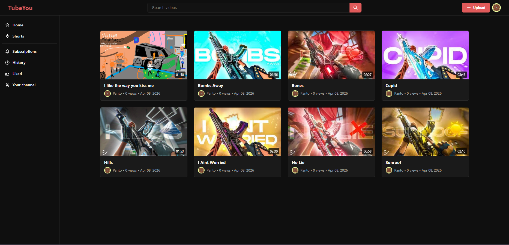
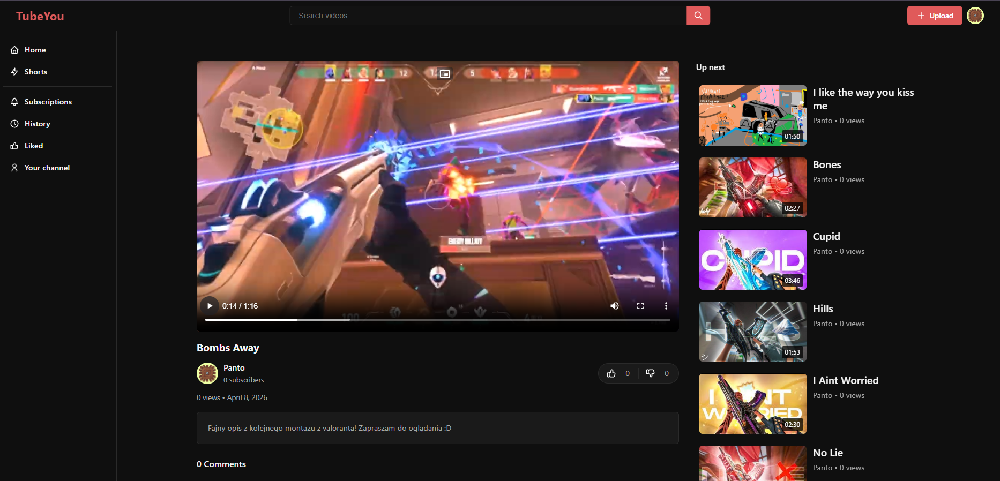
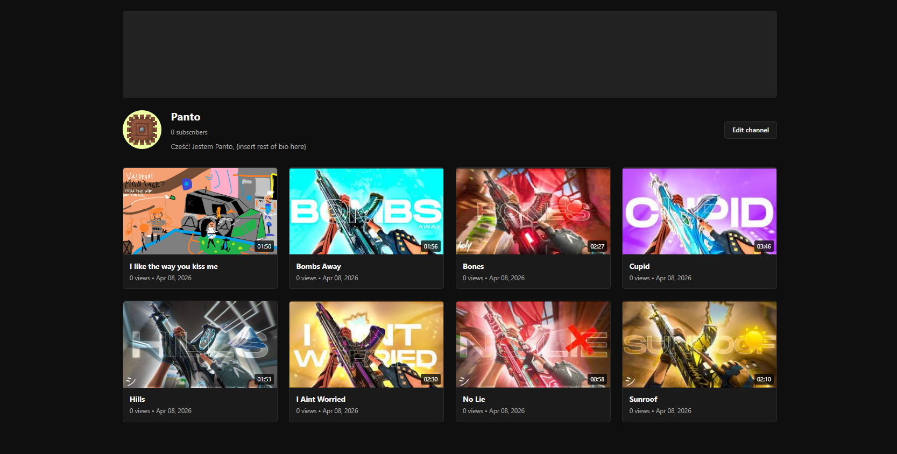
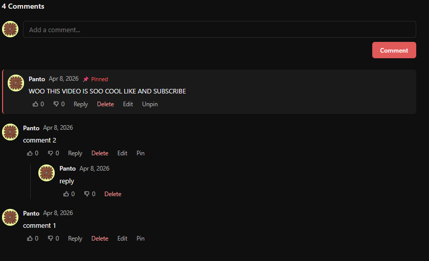

# TubeYou

A YouTube-inspired video platform built with PHP (MVC), MariaDB, and vanilla JS.

---

## 🚀 Overview
TubeYou is a full-stack web application replicating core YouTube features, built from scratch without frameworks.  
The project focuses on clean architecture (MVC), performance, and understanding how real platforms work internally.

---

## ✨ Features
- Video upload & streaming (HTTP range support)
- Like / dislike system
- Subscriptions
- Advanced comment system:
  - replies  
  - likes  
  - pinning  
  - editing  
- User profiles (avatar, banner, bio)
- Email verification & password reset (PHPMailer + Gmail SMTP)
- Dark mode
- Full-text search
- Algorithm-based feed scoring

---

## 🛠 Tech Stack
- PHP 8.x (no framework)
- MariaDB
- Vanilla JavaScript
- PHPMailer
- vlucas/phpdotenv

---

## 📸 Screenshots

### Home


### Video Page


### Profile


### Comments


---

## ⚙️ Setup

### Install
```
composer install
```

```
cp .env.example .env
```

Fill in credentials, then:

```
php database/reset.php
```

---

## 🌐 Local Development (XAMPP)

### .htaccess
```
Options -MultiViews
RewriteEngine On
RewriteCond %{REQUEST_FILENAME} !-f
RewriteCond %{REQUEST_FILENAME} !-d
RewriteRule ^ index.php [L]
```

### Enable mod_rewrite
```
C:\xampp\apache\conf\httpd.conf
```

Uncomment:
```
LoadModule rewrite_module modules/mod_rewrite.so
```

### VirtualHost
```
C:\xampp\apache\conf\extra\httpd-vhosts.conf
```

```
<VirtualHost *:80>
    ServerName tubeyou.local
    DocumentRoot "PATH_TO_PROJECT\public"

    <Directory "PATH_TO_PROJECT\public">
        AllowOverride All
        Require all granted
    </Directory>
</VirtualHost>
```

### Hosts file
```
C:\Windows\System32\drivers\etc\hosts
```

```
127.0.0.1 tubeyou.local
```

Restart Apache and open:
```
http://tubeyou.local
```

---

## 🌍 Access from other devices

### Option A — Router DNS (recommended)
```
tubeyou.local → YOUR_LOCAL_IP
```

### Option B — Hosts (per device)
```
YOUR_LOCAL_IP tubeyou.local
```

---

## 📂 Project Structure
```
/controllers   — HTTP handlers
/models        — Repository classes
/views         — PHP templates
/services      — MailService etc.
/helpers       — utilities (csrf, formatNumber, etc.)
/database      — schema, seed, reset
/public        — entry point + assets
```

---

## 🧠 Architecture
- MVC pattern (custom implementation)
- Stateless request handling
- PDO-based data layer
- Service layer for external integrations
- Helper-based utilities

---

## 🗺 Roadmap

### 🔥 Core Improvements
- [x] Video processing (thumbnails, compression)
- [x] Better recommendation algorithm
- [x] Watch history tracking
- [x] Notifications system

### 👤 User Features
- [ ] Playlists
- [x] Watch later
- [x] Channel customization
- [x] User settings panel

### 💬 Social
- [ ] Comment mentions (@user)
- [x] Comment sorting (top/new)
- [ ] Community posts

### ⚡ Performance
- [ ] Caching layer (Redis or file-based)
- [ ] Lazy loading improvements
- [ ] Query optimization

### 🔐 Security
- [x] Rate limiting
- [x] CSRF improvements
- [x] Input sanitization audit

### 🌍 Deployment
- [x] Production deployment guide
- [ ] Docker setup
- [ ] CI/CD pipeline

---

## ⚠️ Notes
- Local domain requires hosts/DNS setup  
- Apache must allow external connections for LAN access  
- This project is for educational purposes  

---

## 📜 License
MIT License — see LICENSE file for details.
